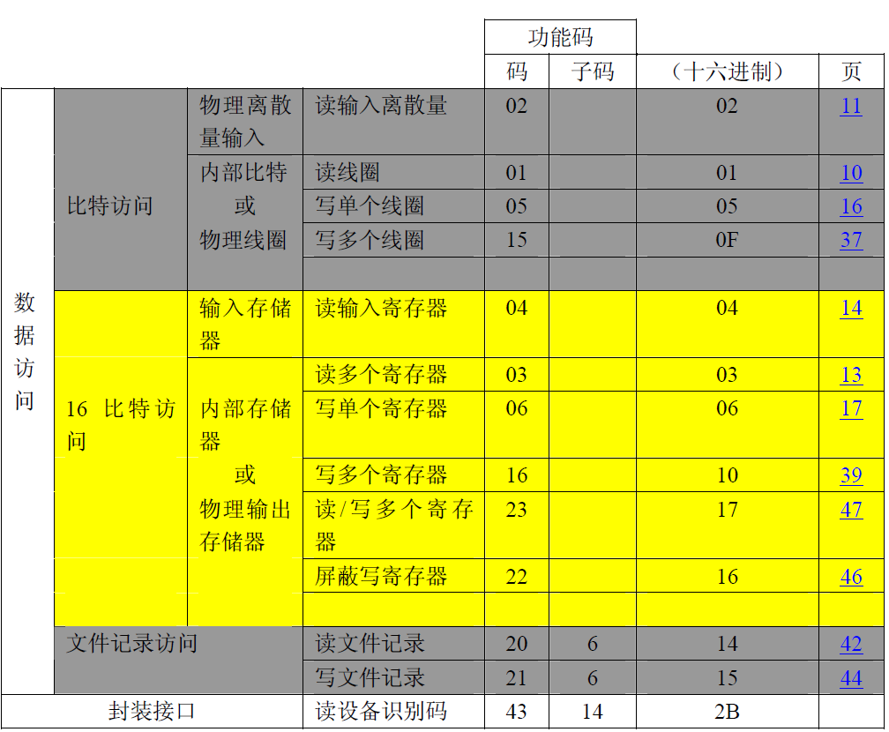

# Modbus协议

1、Modbus/TCP报文格式

| 起始字符组  | Device Address | Function Code | Data             | Error check | 结束规定 |
| ----------- | -------------- | ------------- | ---------------- | ----------- | -------- |
| 6个起始字符 | 8 Bits         | 8 Bits        | Number of 8 Btis | 不使用      | 不使用   |

```c
起始字符组：于前面再多加6个字符，以定义一些TCP/IP的需要 系数。说明如下： 

Byte0：本次通信Message的编号以2 bytes整数（Byte 0、1）表示，此 byte为上字符，一般是由Master编号之，以区分每次Message。如果是Slave则将Master传来的Query Message照转至Response Message。 

Byte1：本次通信Message的编号下字符。

Byte2：通信协议识别号码以2 bytes整数（Byte 2、3）表示，此 byte 为上字符，于此处为零。 

Byte3：通信协议识别号码下字符，于此处为零。 

Byte4：Message长度以2 bytes整数（Byte 4、5）表示，此 byte 为上字符（由Device Address至Data为止），因为长度不能超过256位，所以此位永远为零。 

Byte5：Message长度下字符（由Device Address至Data为止）。
```

```c
00 00 00 00 00 06/*后面还有6个数据*/ 01 03 13 88 00 01
```

公共功能码定义



```c
服务端接收数据
Rx：00 00 00 00 00 06 01 03 13 88 00 0A /*读取5000地址开始的10个数据*/
Tx: 00 00 00 00 00 17 01 03 14 00 0A 00 00 00 00 00 00 00 00 00 00 00 00 00 00 00 00 00 00
```

```c
服务端接收数据
Rx：00 00 00 00 00 06 01 06/*写单个*/ 13 88 00 01 /*往5000地址开始的1个数据，值是1*/
Tx: 00 00 00 00 00 06 01 06 13 88 00 01
    
Rx：00 00 00 00 00 0F 01 10/*写多个*/ 13 88/*起始地址*/ 00 04/*寄存器数量*/ 08/*后面字节数*/ 00 02 00 04 00 06 00 08 /*往5000地址开始的4个数据，值是2,4,6,8*/
Tx: 00 00 00 00 00 06 01 10 13 88 00 04
```

